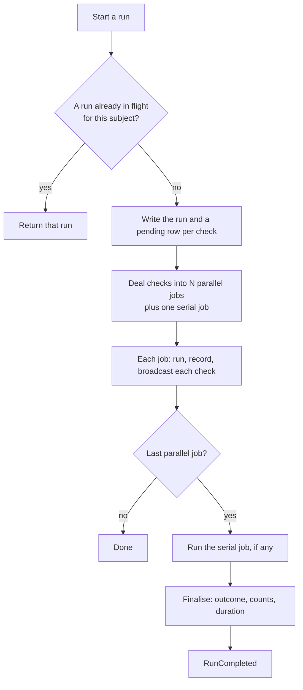

# Diagnostics

Unit tests for your records. Write small, named checks against an Eloquent model, and this
package runs them as a suite: in parallel on your queue, with live progress in the browser,
every result stored, a console command for scripts and CI, and a queue job that can gate the
next step of a chain on a pass. A check that knows how to put its problem right can offer a
Fix button, asking for anything it needs to know first.

Think of a lettings site that checks each property listing before it goes live: is the rent in
a sensible range for the area, is there a floor plan, does the EPC rating look real? Each of
those questions is a check, together they are a suite, and the listing is the subject. Anything
with a primary key can be a subject.

- [How it works](#how-it-works)
- [Requirements](#requirements)
- [Installation](#installation)
- [Configuration](#configuration)
- [Registering a suite](#registering-a-suite)
- [Writing checks](#writing-checks)
- [Fixing problems](#fixing-problems)
- [Running a suite](#running-a-suite)
- [The Vue panel](#the-vue-panel)
- [Reading results from code](#reading-results-from-code)
- [Gating a process on a pass](#gating-a-process-on-a-pass)
- [Events](#events)
- [HTTP API](#http-api)
- [Maintenance](#maintenance)
- [Testing the package](#testing-the-package)

## How it works

| Term | Meaning |
|---|---|
| Suite | A named set of checks for one model class, registered by your application |
| Subject | The model instance a run inspects |
| Check | One class that asks one question and returns one result |
| Result | An outcome, a one-line summary and any number of findings |
| Run | One execution of a whole suite against one subject |

A check's **outcome** is one of `passed`, `warning`, `failed`, `skipped` or `errored`. A check
that throws is recorded as `errored` with the exception message; the run carries on. A check
marked as advisory can only ever warn.

A run's **outcome** is `failed` if any check failed, otherwise `errored` if any check errored,
otherwise `passed_with_warnings` if any warned, otherwise `passed`. An error blocks a gate:
a run that could not check something is not a pass.

**The database is the record.** When a run starts, a row is written for the run and one for
every check, all pending, so a UI can show the full list at once. Each result row is updated
the moment its check finishes, and the run's counts move with it. Anything that wants to
know where a run stands (a page refresh, a second browser, another process, the console
command) reads the same rows. Broadcast events are a courtesy for whoever is watching live.

**Two ways to execute, one engine.** The *sync* executor runs every check in the calling
process. The *queued* executor deals the checks into a configurable number of jobs on a
configurable queue, so a suite of slow checks finishes in a fraction of the time. Checks that
declare they are not safe to run alongside others go into one extra job that runs after the
parallel ones have finished. Both executors call the same code to run a check, record it and
raise its events, so a run looks the same whichever way it was started.

**Completion without job batches.** The queued executor does not use `Bus::batch`, so there is
no `job_batches` table to install. Each job decrements a counter on the run row as it finishes
and then tries to claim the next step with a single conditional `UPDATE`; whichever job's
update succeeds does the next step. This works on any database and under the `sync` queue
driver, which is how the tests exercise it.



## Requirements

- PHP 8.4
- Laravel 11, 12 or 13
- For the panel: Vue 3 and Vite in the host application
- For live progress: a configured broadcaster and Laravel Echo in the browser. Without them the
  panel polls.

## Installation

```sh
composer require mralston/diagnostics
php artisan migrate
```

The service provider and the `Diagnostics` facade are discovered automatically. The
migrations run from the package; publish them only if you want copies in your application:

```sh
php artisan vendor:publish --tag=diagnostics-migrations
```

Publish the config to change any default:

```sh
php artisan vendor:publish --tag=diagnostics-config
```

## Configuration

Everything has a default, and most applications only touch the queue. The full list is in
`config/diagnostics.php`, with comments.

### Queue

Queued runs go to the connection and queue named here. Null means your application's default,
which suits a single worker pool.

```dotenv
DIAGNOSTICS_QUEUE_CONNECTION=redis
DIAGNOSTICS_QUEUE=diagnostics
```

A dedicated queue lets diagnostics run on their own workers, on another server if you like,
without slow checks holding up the rest of your jobs. Make sure something listens on it:

```php
// config/horizon.php
'supervisor-diagnostics' => [
    'connection' => 'redis',
    'queue' => ['diagnostics'],
    'balance' => 'simple',
    'maxProcesses' => 3,
    'tries' => 1,
    'timeout' => 900,
],
```

or, without Horizon:

```sh
php artisan queue:work redis --queue=diagnostics --tries=1
```

If nothing is listening, a run started from the browser stays pending and the panel says it is
waiting for a worker.

### Other settings

| Key | Default | Meaning |
|---|---|---|
| `parallel_batches` | 3 | Jobs a queued run is split across. Env `DIAGNOSTICS_PARALLEL_BATCHES` |
| `default_executor` | `queued` | What the HTTP API and `Diagnostics::start()` use. `sync` runs in the request |
| `check_timeout` | 60 | Advisory seconds per check; sets each job's timeout |
| `chain.acceptable` | `passed`, `passed_with_warnings` | Outcomes that let a chained job continue and open a gate |
| `coalesce_in_flight` | true | A second start while a run is in flight returns that run |
| `stuck_after_minutes` | 15 | Inactivity after which `diagnostics:reap` abandons a run |
| `waiting_for_worker_after` | 10 | Seconds before the API reports a pending run as waiting for a worker |
| `freshness.ttl_minutes` | 1440 | Age at which a completed run no longer opens a gate. 0 disables |
| `retention_days` | 30 | Age at which `diagnostics:prune` deletes runs |
| `broadcast.enabled` | true | Env `DIAGNOSTICS_BROADCAST` |
| `routes.prefix` / `routes.middleware` | `diagnostics` / `web`, `auth` | Where the JSON API lives and what protects it |

Any suite can be overridden by key under `suites`, which wins over its registration:

```php
'suites' => [
    'listing-check' => [
        'label' => 'Listing Check',
        'queue' => 'diagnostics',
        'connection' => 'redis',
        'parallel_batches' => 4,
        'disabled' => [App\ListingChecks\Photos\FloorPlanPresent::class],
    ],
],
```

## Registering a suite

Register suites in a service provider's `boot` method. They are code rather than config
because they carry closures.

```php
use App\Models\Listing;
use Mralston\Diagnostics\Facades\Diagnostics;

public function boot(): void
{
    Diagnostics::suite('listing-check')
        ->label('Listing Check')
        ->subject(Listing::class)
        ->checksIn(app_path('ListingChecks'), 'App\\ListingChecks')
        ->categories(['Property', 'Rent', 'Photos', 'Compliance'])
        ->authorize(fn ($user, Listing $listing) => $user?->can('update', $listing) ?? false)
        ->register();
}
```

| Method | Purpose |
|---|---|
| `label()` | The name shown in the panel, the console and events. Defaults to a headline of the key |
| `subject()` | The model class the suite inspects |
| `checksIn()` | The directory holding the checks and the namespace it maps to, PSR-4 style |
| `categories()` | The order categories appear and run in. Unlisted categories follow alphabetically |
| `authorize()` | Who may see runs and start them, for the HTTP API and the broadcast channel. Defaults to any signed-in user |
| `resolveSubject()` | How to load the subject from its key. Defaults to `find()`, including soft-deleted rows |
| `queue()` | A queue and connection for this suite only |
| `parallelBatches()` | A batch count for this suite only |
| `disable()` | Check classes to leave out |
| `acceptable()` | Run outcomes that open the gate and let the chain job continue. Defaults to `passed` and `passed_with_warnings` |
| `authorizeFix()` | Who may apply fixes. Defaults to `authorize()` |
| `afterFix()` | Work to do after every successful fix, such as recalculating totals. See [Fixing problems](#fixing-problems) |
| `fixFailsOn()` | Exception classes whose message is written for users. A fix that runs into one fails with that message instead of erroring |

A class may have more than one suite. When it does, name the suite wherever the API takes an
optional suite key.

## Writing checks

A check is a class in the suite's directory that extends `Mralston\Diagnostics\Check` and has a
public `run()` method taking the subject and returning a `Result`. Sub-directories become
categories, so `ListingChecks/Rent/RentWithinAreaRange.php` is in the Rent category.

```php
namespace App\ListingChecks\Rent;

use App\Models\Listing;
use App\Services\RentBands;
use Mralston\Diagnostics\Check;
use Mralston\Diagnostics\Result;

class RentWithinAreaRange extends Check
{
    protected string $title = 'Rent is within the usual range for the area';

    protected ?string $description = 'Monthly rent should fall inside the band for the postcode district and bedroom count.';

    public function __construct(private readonly RentBands $bands)
    {
    }

    public function run(Listing $listing): Result
    {
        if ($listing->monthly_rent === null) {
            return $this->fail('No rent has been entered')
                ->finding('Enter the monthly rent', ['page' => 'pricing']);
        }

        $band = $this->bands->for($listing->postcode_district, $listing->bedrooms);

        if ($listing->monthly_rent < $band->min || $listing->monthly_rent > $band->max) {
            return $this->fail("Rent of £{$listing->monthly_rent} is outside £{$band->min} to £{$band->max} for the area")
                ->finding('Check it has not been entered weekly', ['page' => 'pricing']);
        }

        return $this->pass("£{$listing->monthly_rent} a month");
    }
}
```

**Declaring metadata.** Set these as properties:

| Property | Default | Meaning |
|---|---|---|
| `$title` | Headline of the class name | Shown everywhere |
| `$description` | null | Longer explanation, returned by the API |
| `$category` | The sub-directory | Overrides the directory |
| `$canFail` | true | False makes the check advisory: a failure is recorded as a warning |
| `$parallelSafe` | true | False runs the check alone, after the parallel batches |
| `$order` | 100 | Sort weight within the category |
| `$timeout` | config | Advisory seconds; PHP cannot interrupt a running method |

Or override the matching methods (`title()`, `canFail()` and so on) when the answer depends on
something.

**Returning a result.** `pass()`, `warn()`, `fail()` and `skip()` each take an optional
summary and return a `Result`. Chain `finding($message, $data)` for each detail. Return one
result per check, however many things it inspected: put the detail in findings, so the counts
stay per check.

`data` is free-form and travels to the browser. The panel can turn it into a link to the page
where the problem is fixed, through its `finding-link` prop.

Use `skip()` when the check does not apply, such as a parking check on a listing with no
parking. Skips do not affect the outcome.

**Rules for checks.**

- Checks are read-only. Each check is given a freshly loaded subject, and one that leaves the
  model dirty gets an extra finding saying so. A check that saves the subject makes its own run
  stale.
- Throwing is fine; the exception is recorded and the other checks still run. Catch only what
  you can turn into a better message.
- Checks are resolved from the container, so constructor injection works.
- A new file in the directory is a new check. There is nothing to register.

`php artisan diagnostics:list listing-check` shows every discovered check, its category, whether
it can fail and which batch it lands in.

## Fixing problems

A check that knows how to put its problem right can have a `fix()` method. Its failed and
warning results then carry a Fix button in the panel, and can be fixed from code or the console
too. A fix is ordinary application code: it may save the subject, touch related records or call
services, because unlike `run()` it is meant to change things.

**A fix that needs nothing.** Photos on a listing should lead with the front of the property.
The check can put them in order itself:

```php
class PhotosInOrder extends Check
{
    protected string $title = 'Photos start with the front of the property';

    protected string $fixLabel = 'Reorder photos';

    protected ?string $fixDescription = 'Moves the exterior photos to the front, keeping the rest in their order.';

    public function run(Listing $listing): Result
    {
        return $listing->photos->first()?->is_exterior
            ? $this->pass()
            : $this->fail('The first photo is not of the outside');
    }

    public function fix(Listing $listing): string
    {
        $listing->photos
            ->sortBy(fn ($photo) => $photo->is_exterior ? 0 : 1)
            ->values()
            ->each(fn ($photo, $i) => $photo->update(['position' => $i + 1]));

        return 'Exterior photos moved to the front';
    }
}
```

Pressing the button runs the fix straight away. Return a short message to show the user, or
nothing.

**A fix that asks questions.** When the fix needs information only a person has, declare the
questions. The panel shows them in a dialog, the answers are validated, and the fix receives
them as an array keyed by name:

```php
use Mralston\Diagnostics\Fixes\Question;

class RentWithinAreaRange extends Check
{
    protected string $fixLabel = 'Correct the rent';

    // ... run() as before

    public function fixQuestions(mixed $listing): array
    {
        return [
            Question::number('monthly_rent', 'Monthly rent')
                ->suffix('£ a month')
                ->default($listing->monthly_rent)
                ->rules('required|numeric|min:100'),
            Question::select('period', 'The landlord quoted it', ['month' => 'per month', 'week' => 'per week'])
                ->required(),
        ];
    }

    public function fix(Listing $listing, array $answers): string
    {
        $monthly = $answers['period'] === 'week'
            ? round($answers['monthly_rent'] * 52 / 12, 2)
            : $answers['monthly_rent'];

        $listing->update(['monthly_rent' => $monthly]);

        return "Rent set to £{$monthly} a month";
    }
}
```

Questions that never change can go in a `$fixQuestions` property instead, as `Question` objects
or plain arrays with the same keys:

```php
protected array $fixQuestions = [
    ['name' => 'reason', 'type' => 'textarea', 'label' => 'Why is there no floor plan?', 'rules' => 'required|max:500'],
];
```

Override `fixQuestions($subject)` when the questions depend on the record, such as one
question for each tenant who has not confirmed a viewing:

```php
public function fixQuestions(mixed $listing): array
{
    return $listing->viewings->whereNull('confirmed')
        ->map(fn ($viewing) => Question::select("viewing_{$viewing->id}", $viewing->tenant_name, [
            'yes' => 'Coming',
            'no' => 'Cancelled',
        ])->placeholder('No reply yet'))
        ->values()
        ->all();
}
```

| Question type | Input | The fix receives |
|---|---|---|
| `text`, `textarea`, `email` | Text | A string, or null |
| `number` | Number | An int or float, or null |
| `date` | Date picker | A `Y-m-d` string, or null |
| `select`, `radio` | A choice of `options` (value => label) | The chosen value, or null |
| `checkbox` | A tick box | A boolean |

Each question takes `label`, and optionally `help`, `default`, `placeholder`, `suffix` (a unit
shown after the input) and `rules` in Laravel's validation syntax. An answer is optional
unless its rules say `required`, and a choice must be one of its options.

**Stopping a fix.** Call `$this->cannotFix('reason')` when the fix finds it cannot help, such as
a missing record it would need. The reason is shown to the user, nothing the fix wrote is kept,
and the Fix button stays for another try. A fix that throws anything else is recorded as
errored, logged, and rolled back in the same way.

Your application may already refuse some changes with exceptions of its own, such as a listing
that cannot be repriced once a tenant has paid a holding deposit. Name those classes with the
suite's `fixFailsOn()`, and a fix that runs into one, in `fix()` or in `afterFix`, fails with
the exception's message rather than a generic error:

```php
Diagnostics::suite('listing-check')
    // ...
    ->fixFailsOn([ListingLockedException::class])
    ->register();
```

**Withholding a fix.** A fix is offered for every failed or warning result of a check that has
one. When a particular problem is not one the fix can solve, say so from `run()`:

```php
return $this->fail('There are no photos at all')->withoutFix();
```

**What happens when a fix runs.**

1. The answers are validated against the questions, which are resolved against the record as
   it is now. Invalid answers come back to the dialog with messages.
2. The fix and the suite's `afterFix` callback run in one database transaction.
3. The check runs again, and its result is updated in place with the new outcome.
4. The run is marked as fixed, which makes it out of date: only one check has seen the change,
   so the gate stays closed until the suite is run again. The panel starts that run for you.
5. The attempt is recorded in `diagnostic_fixes` with who made it, the answers, the outcome
   before and after, and any message, and the `CheckFixed` event is raised.

Use `afterFix` for the work your application normally does after saving the subject, so a fixed
record is the same as one corrected by hand. It receives a freshly loaded subject, the result
and the answers:

```php
Diagnostics::suite('listing-check')
    // ...
    ->authorizeFix(fn ($user, Listing $listing) => $user?->can('update', $listing) && ! $listing->is_live)
    ->afterFix(fn (Listing $listing) => $listing->refreshSearchIndex())
    ->register();
```

**From code or the console.**

```php
$fix = Diagnostics::fix($result, ['monthly_rent' => 1450, 'period' => 'month'], auth()->user());

$fix->status;     // FixStatus::Succeeded, Failed or Errored
$fix->resolved(); // true when the check now passes
$fix->message;
```

```sh
php artisan diagnostics:fix 5521 --answer=monthly_rent=1450 --answer=period=month
```

`Diagnostics::fix()` throws `FixUnavailable` when the run has not finished or the result has no
fix on offer, and a `ValidationException` for invalid answers. The command exits 0 when the
check now passes, 1 when it does not, and 2 for invalid answers.

## Running a suite

### From code

```php
use Mralston\Diagnostics\Facades\Diagnostics;

$run = Diagnostics::run($listing);        // in this process; returns the finished run
$run = Diagnostics::dispatch($listing);   // on the queue; returns the pending run
$run = Diagnostics::start($listing);      // whichever default_executor says
```

Each takes the suite key as a second argument when the class has more than one suite.

### As a queued job, or a step in a chain

`RunDiagnosis` runs a suite as a job. In a chain, it stops the chain unless the outcome is
acceptable, which is how "only publish the listing if it passes" is written:

```php
use Illuminate\Support\Facades\Bus;
use Mralston\Diagnostics\Jobs\RunDiagnosis;

Bus::chain([
    new RunDiagnosis('listing-check', $listing),
    new PublishListing($listing),
])->catch(function (Throwable $e) {
    // $e is DiagnosisFailed, with ->run, when the listing did not pass.
})->dispatch();
```

The job runs its checks in its own process rather than fanning out, because a chain step has to
have finished before the next one is released. It is tried once: its results are stored as they
happen, so a retry would only repeat them.

| Argument | Default | Meaning |
|---|---|---|
| `$suite` | | The suite key, or null when the model has one suite |
| `$subject` | | The model, or its key when the suite is named |
| `requirePass` | true | Throw `DiagnosisFailed` unless the outcome is acceptable |
| `acceptable` | config | Outcomes that count as a pass for this job |
| `reuseFresh` | false | Skip running when a fresh acceptable run already exists |

Standalone, with `requirePass: false`, it is a way to run a suite unattended; the events still
broadcast in case anyone is watching.

### From the console

```sh
php artisan diagnostics:run listing-check 1701
```

```
Listing Check: Listing #1701 (run 312, 14 checks)

 Property
  PASS  Address is complete ........................................ 3ms
  PASS  Bedroom count matches the floor plan ....................... 6ms
 Rent
  FAIL  Rent is within the usual range for the area ................ 9ms
        Rent of £395 is outside £1,150 to £1,900 for the area
        - Check it has not been entered weekly
 Photos
  WARN  At least eight photos ...................................... 2ms
        Five photos uploaded
  SKIP  Parking photo ............................................ no parking

 10 passed, 1 warning, 1 failed, 2 skipped, 0 errored in 0.4s
 Outcome: FAILED
```

The heading uses the suite's label, so every application names its own.

| Option | Meaning |
|---|---|
| `--queue` | Hand the run to the queue workers and follow it by reading the results as they are stored |
| `--no-wait` | With `--queue`, print the run id and exit |
| `--json` | Print the finished run as JSON |
| `--no-broadcast` | Do not broadcast this run's events |
| `--fail-on-warnings` | Exit 1 for a pass with warnings |

Exit codes: 0 passed, 1 failed, 2 errored or could not run.

## The Vue panel

The package ships Vue 3 source rather than a built bundle. Your application compiles it with
its own Vue and Vite, so there is no second copy of Vue on the page, nothing to publish, and
nothing to go stale after an upgrade.

Add the package's Vite plugin, which registers an `@mralston/diagnostics` import alias:

```js
// vite.config.js
import diagnostics from './vendor/mralston/diagnostics/vite.js';

export default defineConfig({
    plugins: [laravel({ /* ... */ }), vue(), diagnostics()],
});
```

Because the source lives in `vendor`, run `composer install` before `npm run build` in CI and
deployment scripts.

Mount the panel anywhere, as an Inertia page component or as an island in a Blade view:

```blade
<div id="listing-check" data-subject="{{ $listing->id }}"></div>
@vite('resources/js/listing-check.js')
```

```js
// resources/js/listing-check.js
import { createApp } from 'vue';
import { DiagnosticsPanel } from '@mralston/diagnostics';

const el = document.getElementById('listing-check');

createApp(DiagnosticsPanel, {
    suite: 'listing-check',
    subjectId: el.dataset.subject,
}).mount(el);
```

| Prop | Default | Meaning |
|---|---|---|
| `suite` | | Suite key |
| `subject-id` | | The subject's key |
| `label` | the suite's label | Heading |
| `base-url` | `/diagnostics` | Where the API is mounted |
| `echo` | `window.Echo` | An Echo instance, or `null` to poll |
| `poll-interval` | 2000 | Milliseconds between polls without Echo |
| `auto-run` | false | Start a run on load when there is no fresh one |
| `run-id` | | Show a particular run instead of the latest |
| `can-run` | true | Show the Run button |
| `hide-passed` | false | Start with passed checks hidden |
| `summarise-pass` | true | Show a clean pass as "All checks passed." with the detail behind a More info link |
| `finding-link` | | `(finding, result) => ({ href, label })` to link a finding to where it is fixed |
| `copy` | | Override any string; see `DEFAULT_COPY` in the component |
| `icon` | | SVG markup shown beside the heading in the accent colour. Omit for no icon |
| `can-fix` | from the server | Show Fix buttons. By default the suite's `authorizeFix` decides |
| `rerun-after-fix` | true | Start a fresh run after a successful fix, so every check sees the change |

Events: `loaded` with the suite, run and gate; `started` with the run; `completed` with the
run and the gate as the server sees it once the run has finished; `fixed` with the fix, the
updated result and the gate after a fix. Slots: `icon` (anything other
than an SVG string), `header-actions`, `result-extra` (per result), `footer` and `empty`.

```js
createApp(DiagnosticsPanel, {
    suite: 'listing-check',
    subjectId: el.dataset.subject,
    icon: '<svg viewBox="0 0 24 24" fill="none" stroke="currentColor" stroke-width="2">…</svg>',
}).mount(el);
```

An advisory check (`$canFail = false`) that finds a problem is shown as a warning with the note
"This is a warning only. It will not count as a failure." Change it with the `downgraded` key
of `copy`.

With Echo, the panel subscribes to the run's private channel. It re-reads the run on a slow
timer as a safety net, and falls back to polling if the subscription fails.

### Styling

The panel brings its own CSS, with every class prefixed `dx-`, and uses no Tailwind or
Bootstrap classes, so it looks the same whatever framework the page uses. Colours, font and
radius are custom properties. Set them on `.dx` or any ancestor:

```css
.dx {
    --dx-accent: #7a3cff;      /* buttons, progress, links */
    --dx-font: 'Source Sans 3', sans-serif;
    --dx-radius: 6px;
}
```

| Property | Used for |
|---|---|
| `--dx-accent`, `--dx-accent-fg` | Button, progress bar, links, running state |
| `--dx-pass`, `--dx-warn`, `--dx-fail`, `--dx-skip`, `--dx-err` | Outcome colours |
| `--dx-fg`, `--dx-muted` | Text |
| `--dx-surface`, `--dx-soft`, `--dx-border` | Background, finding panels, rules |
| `--dx-font`, `--dx-radius` | Typeface and corner radius |

### Building your own

The panel is one rendering of a composable. If it does not fit, build your own on the same
state:

```js
import { useDiagnosticsRun } from '@mralston/diagnostics';

const {
    suite, checks, run, results, categories, counts, progress,
    isRunning, waitingForWorker, gate, start,
} = useDiagnosticsRun({ suite: 'listing-check', subjectId: 1701 });
```

## Reading results from code

```php
Diagnostics::latestRun($listing);   // newest run, any status, or null
Diagnostics::inFlight($listing);    // the pending or running run, or null
Diagnostics::status($listing);      // RunStatusData: status, outcome, counts, completed of total, fresh
```

The models are ordinary Eloquent models with scopes for anything bespoke:

```php
use Mralston\Diagnostics\Models\DiagnosticRun;

DiagnosticRun::forSubject($listing)->suite('listing-check')->completed()->latest('id')->first();

DiagnosticRun::suite('listing-check')
    ->where('outcome', 'failed')
    ->where('created_at', '>', now()->subDay())
    ->get();

$run->results;                    // DiagnosticResult models in order
$run->counts();                   // ['passed' => 10, 'warning' => 1, ...]
```

### In lists and tables

`latestRuns()` fetches the latest run for a page of records in one query, keyed by record key.
It accepts a collection, an array or a paginator. The `outcome` Blade component draws the same
symbols as the panel, with the date in its tooltip, and fades a run that is out of date when
given the record.

```blade
@php($runs = Diagnostics::latestRuns($listings, 'listing-check'))

@foreach($listings as $listing)
    {{ $listing->id }}
    <x-diagnostics::outcome :run="$runs->get($listing->id)" :subject="$listing" />
@endforeach
```

| Attribute | Default | Meaning |
|---|---|---|
| `run` | | The run, or null for nothing |
| `subject` | | The record, to fade a run that is out of date |
| `variant` | `solid` | `solid` for a white symbol on a filled circle, `outline` for a coloured symbol in a ring. An errored run is always an outline, a red exclamation mark in a red ring |
| `size` | 16 | Pixels |

## Gating a process on a pass

```php
$gate = Diagnostics::gate($listing);

if (! $gate->passed()) {
    return back()->withErrors($gate->reason());
}
```

A gate is open when the latest completed run is fresh and its outcome is acceptable: `passed` or
`passed_with_warnings` unless the suite sets its own list with `acceptable()`. A suite whose
errors are the application's problem rather than the user's can accept `errored` too. A run is
fresh when the subject's `updated_at` has not moved since the run started and the run is
younger than `freshness.ttl_minutes`. `reason()` explains a closed gate in a sentence.

## Events

| Event | When | Broadcast payload |
|---|---|---|
| `RunStarted` | The run and its pending rows exist | Run id, suite, subject, total |
| `CheckStarted` | A check begins | Run id, result id, position |
| `CheckCompleted` | A check's result is stored | Outcome, summary, duration, the first few finding messages, running counts |
| `RunCompleted` | The run is finalised | Outcome, counts, duration |
| `CheckFixed` | A fix was attempted, whatever its outcome | Not broadcast; carries the `DiagnosticFix` |

The first four are ordinary Laravel events you can listen for; `RunCompleted` carries the run model.
They broadcast immediately on the private channel `diagnostics.run.{id}`, whose authorisation
the package registers using the suite's `authorize` callback. Payloads are trimmed to stay
inside Pusher's size limit; the full result is always in the database and the API. A
broadcaster outage is logged and never fails a check.

## HTTP API

Mounted under `routes.prefix` with `routes.middleware`. Every route applies the suite's
`authorize` callback.

| Route | Returns |
|---|---|
| `GET /diagnostics/{suite}/{subject}` | Suite label, checks, latest run with results, gate |
| `POST /diagnostics/{suite}/{subject}/runs` | Starts a run: 201, or 200 with the run already in flight |
| `GET /diagnostics/{suite}/{subject}/runs` | Paginated run history |
| `GET /diagnostics/runs/{run}` | A run with every result |
| `GET /diagnostics/runs/{run}/results/{result}` | One result including error detail |
| `GET /diagnostics/runs/{run}/results/{result}/fix` | The fix's label, description and questions, with defaults from the record now |
| `POST /diagnostics/runs/{run}/results/{result}/fix` | Applies the fix with `answers`: 200 with the fix, result, run and gate; 422 for invalid answers; 409 when no fix is on offer. Also applies `authorizeFix` |

## Maintenance

Schedule both commands:

```php
// routes/console.php
Schedule::command('diagnostics:prune')->daily();
Schedule::command('diagnostics:reap')->everyTenMinutes();
```

`diagnostics:prune` deletes runs older than `retention_days`. `diagnostics:reap` closes runs that
have made no progress for `stuck_after_minutes`, which happens when a worker is lost in a way
the queue never reports. What did finish is kept and the rest is recorded as errored.

## Testing the package

```sh
composer install
./vendor/bin/pest
```

## Licence

MIT. See [LICENSE.md](LICENSE.md).
